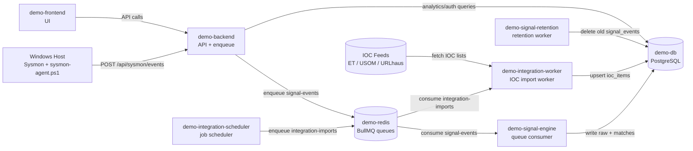

# Container Operations & Tuning Guide

This document tracks container responsibilities, key functions, and tuning/maintenance notes for the demo environment.

## Environment

- Host: `192.168.1.251`
- Project path: `/opt/demo-runbook`
- Startup command:

```bash
cd /opt/demo-runbook
docker compose up -d --build
```

---

## Service Inventory

### 1) `demo-db` (PostgreSQL)
**Purpose**
- Primary datastore for users, IOC data, signal events, and IOC match events.

**Key tables (relevant to current flow)**
- `signal_events` → raw telemetry events (retention: 30 days)
- `ioc_match_events` → IOC matches (kept indefinitely)
- `signal_sources` → connected source metadata (e.g., Sysmon/Windows)
- `ioc_items` → IOC inventory

**Ops notes**
- Check health:
  ```bash
  docker compose exec -T db pg_isready -U demo -d demo
  ```
- Quick table counts:
  ```bash
  docker compose exec -T db psql -U demo -d demo -c "SELECT count(*) FROM signal_events;" -c "SELECT count(*) FROM ioc_match_events;"
  ```

---

### 2) `demo-redis`
**Purpose**
- Queue broker for async jobs.

**Used queues**
- `integration-imports` (IOC integration jobs)
- `signal-events` (Sysmon event processing jobs)

**Ops notes**
- Redis memory should be monitored if event rate increases.

---

### 3) `demo-backend`
**Purpose**
- API layer for auth, UI data, integrations, and analytics.

**Key analytics endpoints**
- `GET /api/analytics/data-sources`
- `GET /api/analytics/raw-events?limit=10`
- `GET /api/analytics/ioc-matches?limit=10`
- `POST /api/sysmon/events` (ingest entrypoint)

**Ops notes**
- Runs migrations on startup.
- If startup race appears with other migration-running containers, start backend first.

---

### 4) `demo-signal-engine`
**Purpose**
- Dedicated signal processing worker (BullMQ consumer).
- Reads from `signal-events` queue.
- Writes raw events to `signal_events` and matches to `ioc_match_events`.

**Current behavior**
- Processes Sysmon events from Windows agent.
- Score/filter logic exists in worker.

**Ops notes**
- Logs:
  ```bash
  docker compose logs -f --tail=100 signal-engine
  ```
- Scale suggestion:
  - Increase `SIGNAL_WORKER_CONCURRENCY`
  - Optionally run multiple replicas (later phase)

---

### 5) `demo-signal-retention`
**Purpose**
- Raw retention worker.
- Deletes `signal_events` records older than 30 days.

**Config**
- `RAW_RETENTION_DAYS=30`
- `RETENTION_CHECK_INTERVAL_SECONDS=3600`

**Why this exists**
- Keeps raw telemetry footprint controlled while preserving IOC match history forever.

**Ops notes**
- Logs:
  ```bash
  docker compose logs -f --tail=100 signal-retention
  ```

---

### 6) `demo-integration-scheduler`
**Purpose**
- Schedules IOC feed import jobs.

### 7) `demo-integration-worker`
**Purpose**
- Executes IOC import jobs and updates IOC dataset.

**Ops notes**
- If IOC updates stop, check both scheduler and worker logs.

---

### 8) `demo-frontend`
**Purpose**
- Web UI.

**Current relevant pages**
- Dashboard (world map)
- Analytics
  - Connected Data Sources
  - Last 10 Raw Events
  - Last 10 IOC Match Events
- Incident (placeholder for now)

---

## System Diagram



## Windows Demo Telemetry Path

1. Sysmon captures events (`ProcessCreate`, `NetworkConnect`, `DnsQuery`)
2. `sysmon-agent.ps1` sends data to:
   - `POST http://192.168.1.251/api/sysmon/events`
3. Backend enqueues to Redis `signal-events`
4. Signal engine processes and writes DB records
5. Analytics page reads and displays results

Related files:
- `reports/sysmon-agent.ps1`
- `reports/sysmon-full-network.xml`
- `docs/windows-demo-config.md`

---

## Tuning Checklist (Short)

### Performance
- Keep analytics endpoints bounded (`limit`, recent window).
- Prefer precomputed tables (`ioc_match_events`) over heavy runtime joins.
- Add/verify DB indexes after schema updates.

### Reliability
- Avoid migration races by controlling which container runs migrations.
- Keep worker logs visible during demos.
- Use restart policies (already enabled).

### Data lifecycle
- Raw telemetry retained for 30 days.
- IOC match records retained indefinitely.
- Revisit policy if DB growth accelerates.

---

## Daily Ops Commands

```bash
cd /opt/demo-runbook

docker compose ps
docker compose logs --tail=100 backend
docker compose logs --tail=100 signal-engine
docker compose logs --tail=100 signal-retention

docker compose exec -T db psql -U demo -d demo -c "SELECT now();" \
  -c "SELECT count(*) AS raw_count FROM signal_events;" \
  -c "SELECT count(*) AS ioc_match_count FROM ioc_match_events;"
```

---

## Change Notes

When adding/removing containers, update this file with:
- container name
- responsibility
- key environment variables
- related endpoint/queue/table
- one health-check command
