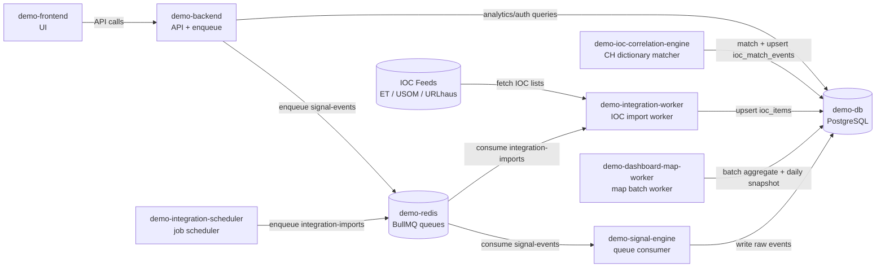

# Container Operations & Tuning Guide

This document tracks container responsibilities, key functions, and tuning/maintenance notes for the demo environment.

## Environment

- Host: `192.168.1.251`
- Project path: `/opt/demo-runbook`
- Startup command:

```bash
cd /opt/demo-runbook
docker compose up -d --build
```

---

## Service Inventory

### 1) `demo-db` (PostgreSQL)
**Purpose**
- Primary datastore for users, IOC data, signal events, and IOC match events.

**Key tables (relevant to current flow)**
- `signal_events` → raw telemetry events (retention: 30 days)
- `ioc_match_events` → IOC matches (kept indefinitely)
- `signal_sources` → connected source metadata (legacy / analytics)
- `ioc_items` → IOC inventory

**Ops notes**
- Check health:
  ```bash
  docker compose exec -T db pg_isready -U demo -d demo
  ```
- Quick table counts:
  ```bash
  docker compose exec -T db psql -U demo -d demo -c "SELECT count(*) FROM signal_events;" -c "SELECT count(*) FROM ioc_match_events;"
  ```

---

### 2) `demo-redis`
**Purpose**
- Queue broker for async jobs.

**Used queues**
- `integration-imports` (IOC integration jobs)
- `signal-events` (signal processing jobs)

**Ops notes**
- Redis memory should be monitored if event rate increases.

---

### 3) `demo-backend`
**Purpose**
- API layer for auth, UI data, integrations, and analytics.

**Key analytics endpoints**
- `GET /api/analytics/data-sources`
- `GET /api/analytics/raw-events?limit=10`
- `GET /api/analytics/ioc-matches?limit=10`

**Ops notes**
- Runs migrations on startup.
- If startup race appears with other migration-running containers, start backend first.

---

### 4) `demo-signal-engine`
**Purpose**
- Dedicated signal processing worker (BullMQ consumer).
- Reads from `signal-events` queue.
- Writes raw events to `signal_events` and matches to `ioc_match_events`.

**Current behavior**
- Consumes jobs from the `signal-events` queue when producers enqueue them.
- Score/filter logic exists in worker.

**Ops notes**
- Logs:
  ```bash
  docker compose logs -f --tail=100 signal-engine
  ```
- Scale suggestion:
  - Increase `SIGNAL_WORKER_CONCURRENCY`
  - Optionally run multiple replicas (later phase)

---

---


### 5) `demo-ioc-correlation-engine`
**Purpose**
- ClickHouse tabanlı IOC correlation worker.
- `syslog_logs` içindeki parse edilmiş IOC adaylarını dictionary lookup ile eşleştirir.
- Eşleşmeleri PostgreSQL `ioc_match_events` tablosuna batch upsert eder.

**Core behavior**
- Incremental scan (watermark): `ioc_correlation_state`
- ClickHouse dictionaries:
  - `default.ioc_domain_dict`
  - `default.ioc_ip_dict`
- Dedup/Aggregation:
  - `ON CONFLICT (dedup_key, bucket_start)`
  - `hit_count`, `last_seen_at` güncellenir

**Key env vars**
- `IOC_CORRELATION_POLL_INTERVAL_MS` (default `3000`)
- `IOC_CORRELATION_BATCH_SIZE` (default `5000`)
- `IOC_CORRELATION_MAX_BATCHES_PER_TICK` (default `5`)
- `IOC_CORRELATION_DEDUP_WINDOW_SECONDS` (default `300`)

**Ops notes**
- Logs:
  ```bash
  docker compose logs -f --tail=100 ioc-correlation-engine
  ```
- Troubleshooting metric log format:
  - `scanned=... matched=... inserted_or_upserted=... duration_ms=...`

---

### 6) `demo-integration-scheduler`
**Purpose**
- Schedules IOC feed import jobs.

### 7) `demo-integration-worker`
**Purpose**
- Executes IOC import jobs and updates IOC dataset.

**Ops notes**
- If IOC updates stop, check both scheduler and worker logs.

---

### 8) `demo-dashboard-map-worker`
**Purpose**
- Batch worker for Threat World Map aggregation.
- Processes IOC rows in chunks (default 1000) and updates precomputed map tables.
- Maintains daily display snapshot (last 24h processed IOC view), refreshed around local midnight.

**Key env vars**
- `DASHBOARD_MAP_CHUNK_SIZE` (default `1000`)
- `DASHBOARD_MAP_INTERVAL_MS` (default `5000`)

**Key tables**
- `dashboard_map_country_totals`
- `dashboard_map_job_state`
- `dashboard_map_pending_events`
- `dashboard_map_display_snapshot`

**Ops notes**
- Logs:
  ```bash
  docker compose logs -f --tail=100 dashboard-map-worker
  ```
- Progress check:
  ```bash
  docker compose exec -T db psql -U demo -d demo -c "SELECT last_processed_ioc_id, full_rebuild_pending, last_run_at, snapshot_last_refreshed_at FROM dashboard_map_job_state;"
  ```

### 9) `demo-frontend`
**Purpose**
- Web UI (nginx + static build). **Not published on the host**; reached via `demo-proxy` on the Docker network.

**Current relevant pages**
- Dashboard (world map)
- Analytics
  - Connected Data Sources
  - Last 10 Raw Events
  - Last 10 IOC Match Events
- Incident (placeholder for now)

### 10) `demo-proxy`
**Purpose**
- TLS termination and HTTP→HTTPS redirect. Publishes host ports **80** and **443**.

**Certs**
- `proxy/certs/cert.pem` and `key.pem` (gitignored `*.pem`). Empty on first run → entrypoint generates a **self-signed** pair for local/demo.

**Ops notes**
```bash
docker compose logs -f --tail=100 proxy
```

---

## System Diagram

Ana diyagramlar ayrı dosyada tutulur:
- `docs/system-diagram.md` (logical flow + deployment view)



---

## Tuning Checklist (Short)

### Performance
- Keep analytics endpoints bounded (`limit`, recent window).
- Prefer precomputed tables (`ioc_match_events`) over heavy runtime joins.
- Add/verify DB indexes after schema updates.

### Reliability
- Avoid migration races by controlling which container runs migrations.
- Keep worker logs visible during demos.
- Use restart policies (already enabled).

### Data lifecycle
- Raw telemetry retained for 30 days.
- IOC match records retained indefinitely.
- Revisit policy if DB growth accelerates.

---

## Daily Ops Commands

```bash
cd /opt/demo-runbook

docker compose ps
docker compose logs --tail=100 backend
docker compose logs --tail=100 signal-engine
docker compose logs --tail=100 ioc-correlation-engine
docker compose logs --tail=100 dashboard-map-worker

docker compose exec -T db psql -U demo -d demo -c "SELECT now();" \
  -c "SELECT count(*) AS raw_count FROM signal_events;" \
  -c "SELECT count(*) AS ioc_match_count FROM ioc_match_events;" \
  -c "SELECT last_processed_ioc_id, full_rebuild_pending, last_run_at, snapshot_last_refreshed_at FROM dashboard_map_job_state;"
```

---

## Change Notes

When adding/removing containers, update this file with:
- container name
- responsibility
- key environment variables
- related endpoint/queue/table
- one health-check command
