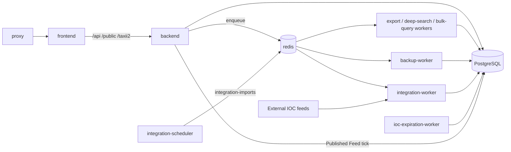

# Container Operations & Tuning

Runtime reference for the current TalonHound Compose stack. Compose definitions in [`docker-compose.yml`](../docker-compose.yml) (and [`docker-compose.release.yml`](../docker-compose.release.yml) for GHCR images) are authoritative.

Related: [deployment](./deployment.md) · [system diagram](./system-diagram.md) · [backup/restore](./backup-restore.md) · [`.env.example`](../.env.example)

Default install path: `/opt/TalonHound` (or the clone directory). Project name: `talonhound`.

---

## Compose services

| Service | Process | Host ports |
|---------|---------|------------|
| `db` | PostgreSQL 16 | none (internal) |
| `redis` | Redis 7 (`--requirepass`) | none (internal) |
| `backend` | `node server.js` | none (internal `:3000`) |
| `frontend` | nginx + static UI | none (internal `:80`) |
| `proxy` | nginx TLS edge | **80**, **443** |
| `integration-scheduler` | `npm run scheduler` | none |
| `integration-worker` | `npm run worker` | none |
| `ioc-expiration-worker` | `npm run ioc-expiration-worker` | none |
| `ioc-search-export-worker` | `npm run ioc-search-export-worker` | none |
| `ioc-deep-search-worker` | `npm run ioc-deep-search-worker` | none |
| `ioc-bulk-query-worker` | `npm run ioc-bulk-query-worker` | none |
| `backup-worker` | `npm run backup-worker` | none |

Only `proxy` publishes ports on the host. Application containers reach each other on the Compose network.

---

## Service inventory

### `db`

**Purpose**
- Primary persistent store: IOCs, feeds, memberships, enrichments, users/RBAC, audit logs, published-feed metadata, job/run history, `schema_migrations`.

**Operational checks**
```bash
docker compose exec -T db pg_isready -U talonhound -d talonhound
```

Compose sets `shm_size: 256mb` and PostgreSQL tuning (`shared_buffers=1024MB`, `work_mem=16MB`, `effective_cache_size=3GB`, `pg_stat_statements`). Volume: `postgres_data`.

### `redis`

**Purpose**
- BullMQ broker for async jobs.
- Cache / coordination (worker heartbeats, feed-sync concurrency, short-lived caches).

**AUTH:** `REDIS_PASSWORD` is required (`--requirepass`). Compose fails if unset.

**Queues (BullMQ names)**

| Queue | Default name | Consumers |
|-------|--------------|-----------|
| Feed imports | `integration-imports` | `integration-worker` |
| IOC search export | `ioc-search-export` | `ioc-search-export-worker` |
| IOC deep search | `ioc-deep-search` | `ioc-deep-search-worker` |
| IOC bulk query | `ioc-bulk-query` | `ioc-bulk-query-worker` |
| System backup | `system-backup` | `backup-worker` |

**Operational checks**
```bash
docker compose exec -T redis redis-cli -a "$REDIS_PASSWORD" ping
docker compose exec -T redis redis-cli -a "$REDIS_PASSWORD" LLEN bull:integration-imports:wait
```

### `backend`

**Purpose**
- HTTP API (auth, IOC CRUD/search, integrations admin, enrichment, published feeds, TAXII, backups API, system health).
- Runs the Published Feed scheduler tick in-process (`PUBLISHED_FEED_TICK_MS`, default 60s).
- Enqueues BullMQ jobs for export / deep search / bulk query / backup; does not consume those queues.

Migrations are **not** applied on startup. Apply with `npm run migrate` before starting app services — see [deployment.md](./deployment.md).

**Health**
- Compose healthcheck: `GET http://127.0.0.1:3000/readyz`
- `GET /healthz` — process up (no DB)
- `GET /readyz` — PostgreSQL + Redis + Date & Time
- `GET /health` — legacy combined check
- `GET /api/system/health` — authenticated aggregate (core, workers, feeds, providers, queues)

**Volumes:** `backup_data` → `/data/backups`, `ioc_export_data` → `/data/ioc-search-exports`, `published_feed_data` → `/data/published-feeds`

### `integration-scheduler`

**Purpose**
- Reconciles BullMQ repeatable jobs with DB feed schedules (built-in feeds, Spamhaus DROP sync, file-artifact reconciliation) on a 60s tick.
- Waits for Setup Wizard completion before arming schedules.

Feed cadences live in PostgreSQL (`integration_feeds` and related config), not in a single global `SCHEDULER_CRON` for the running product path.

### `integration-worker`

**Purpose**
- Consumes `integration-imports`: community feeds (Emerging Threats, USOM, URLhaus, MalwareBazaar, ThreatFox, PhishTank, AlienVault OTX, CERT.PL), custom threat feeds, Spamhaus DROP sync jobs, file-artifact reconciliation jobs.
- Writes IOCs / memberships / run metrics to PostgreSQL.

**Key configuration**
- `FEED_SYNC_CONCURRENCY` (default `2`) — global Redis-enforced ceiling on concurrent feed syncs across the deployment
- Per-feed job timeouts (`USOM_JOB_TIMEOUT_MS`, `EMERGINGTHREATS_JOB_TIMEOUT_MS`, `PHISHTANK_JOB_TIMEOUT_MS`, …)
- `WORKER_LOCK_DURATION_MS` (default `900000`), `INTEGRATION_JOB_TIMEOUT_MS` (default `600000`)

Feed credentials and detailed USOM/abuse.ch knobs: [`.env.example`](../.env.example), [`integration/README.md`](../integration/README.md).

### `ioc-expiration-worker`

**Purpose** (poll loop; not a BullMQ consumer)
- IOC membership / global expiration batches (`IOC_EXPIRATION_POLL_INTERVAL_MS` default 60s, `IOC_EXPIRATION_BATCH_SIZE` default 500)
- Audit-log and operational-history retention
- Terminal `auth_sessions` cleanup (`SESSION_CLEANUP_RETENTION_DAYS`)
- Enrichment-provider active health probes (`ENRICHMENT_HEALTH_PROBE_*`)
- Redis heartbeat for `/api/system/health`

### `ioc-search-export-worker`

**Purpose**
- Consumes `ioc-search-export`; streams CSV artifacts under `/data/ioc-search-exports`.

**Key configuration:** `IOC_EXPORT_WORKER_CONCURRENCY` (default `2`), `IOC_EXPORT_BATCH_SIZE` (5000), `IOC_EXPORT_HARD_LIMIT` (2_000_000), `IOC_EXPORT_RETENTION_HOURS` (24).

### `ioc-deep-search-worker`

**Purpose**
- Consumes `ioc-deep-search`; materializes expensive DSL searches into spool tables.

**Key configuration:** `IOC_DEEP_SEARCH_WORKER_CONCURRENCY` (default `2`), `IOC_DEEP_SEARCH_QUERY_TIMEOUT_MS` (default `600000`), `IOC_DEEP_SEARCH_RETENTION_HOURS` (24).

### `ioc-bulk-query-worker`

**Purpose**
- Consumes `ioc-bulk-query`; async query-wide bulk triage beyond the sync HTTP budget.

**Key configuration:** `IOC_BULK_QUERY_WORKER_CONCURRENCY` (default `2`), `IOC_BULK_QUERY_SYNC_MAX` (500), `IOC_BULK_QUERY_HARD_LIMIT` (50_000).

### `backup-worker`

**Purpose**
- Consumes `system-backup`; owns scheduled backup enqueue (cron ticker) and backup execution.

Schedule/retention/encryption: [backup-restore.md](./backup-restore.md). Volume: `backup_data` → `/data/backups`.

### `frontend`

**Purpose**
- Static React UI behind nginx. Proxies `/api/`, `/public/`, and `/taxii2` to `backend:3000`. Not published on the host.

### `proxy`

**Purpose**
- TLS termination (443) and HTTP→HTTPS redirect (80). Forwards application traffic to `frontend:80`.
- Directly proxies `/healthz` and `/readyz` to `backend:3000`.
- ACME HTTP-01 path: `/.well-known/acme-challenge/`.

**Certs:** bind-mount `./proxy/certs` → `/etc/nginx/certs` (`cert.pem` / `key.pem`). If either file is missing at start, the entrypoint generates a self-signed pair (local/demo). Production certificates: [`proxy/README.md`](../proxy/README.md).

---

## Data stores

### PostgreSQL

Sole application database. Notable responsibilities:

- IOC inventory (`ioc_items` and type partitions), feed memberships, suppressions, tags, classifications
- Integration feed config, queue job rows, run history, checkpoints
- Enrichment result tables and provider config/health
- Published feed definitions, snapshots/chunks/projections, API keys
- Users, sessions, RBAC, audit logs, system settings (timezone, setup)
- Action Center job metadata (exports, deep searches, bulk queries, backups)

Schema baseline: `backend/migrations/001_core.sql` — see [database-migrations.md](./database-migrations.md).

### Redis

Ephemeral. Not included in system backups. After restore, queues and heartbeats re-form as workers reconnect.

### ClickHouse

Not part of the deployment. No Compose service; not used by application code.

### Named volumes

| Volume | Mount | Contents |
|--------|-------|----------|
| `postgres_data` | `db:/var/lib/postgresql/data` | Database files |
| `backup_data` | backend + backup-worker `/data/backups` | Backup archives |
| `ioc_export_data` | backend + export-worker `/data/ioc-search-exports` | Export CSVs |
| `published_feed_data` | backend `/data/published-feeds` | Published-feed file artifacts |

---

## Async processing

```text
integration-scheduler  ──►  Redis (integration-imports)  ──►  integration-worker  ──►  PostgreSQL
                                                                                         ▲
backend (API)  ──enqueue──►  Redis (ioc-search-export | ioc-deep-search | ioc-bulk-query | system-backup)
                                  │                              │
                                  ▼                              ▼
                         dedicated workers              PostgreSQL + volumes

backend (in-process)  ──tick──►  Published Feed generation  ──►  PostgreSQL + published_feed_data

ioc-expiration-worker  ──poll──►  PostgreSQL (+ enrichment health probes / retention)
```

Published feeds are generated inside the **backend** process (advisory-locked ticks), not a separate worker container. Feature flags (`PUBLISHED_FEED_STREAMING_ENABLED`, incremental/chunked) default off in Compose — see `.env.example`.

Each Published Feed has exactly one configured **Window** (`1d` / `3d` / `7d` / `all`): that is the only public IOC time scope maintained for the feed (× enabled formats). **Refresh Interval** is regeneration cadence only — it does not change IOC eligibility. Consumers pull `GET /api/published-feeds/{slug}?api_key=…` (optional `&format=`); they cannot override the feed to another window via `?window=` (a matching `?window=` equal to the configured value remains accepted for compatibility). Create a second feed if you need another time scope.

---

## Enrichment

No dedicated enrichment containers. Providers are configured in **Administration → Enrichment Providers** (optional env fallbacks in `.env.example`).

| Provider key | Role | Remote calls |
|--------------|------|--------------|
| `virustotal` | File / URL / domain reputation | VirusTotal API |
| `ipinfo_lite` | On-demand IP ASN / geo | IPinfo Lite API |
| `abuseipdb` | Public IP reputation (check) | AbuseIPDB API |
| `rdap` | Domain registration (RDAP) | Public RDAP (no API key) |
| `spamhaus_drop` | Periodic DROP/DROPv6 CIDR dataset | Sync via `integration-imports`; local lookup thereafter |

Active health probes for remote providers run on `ioc-expiration-worker`. Disable/enable and test-connection are administered in the UI; results persist in PostgreSQL.

---

## Network

```text
Browser ──HTTPS:443──► proxy ──HTTP──► frontend:80 ──/api|/public|/taxii2──► backend:3000
              │
         HTTP:80 ──301──► HTTPS
              │
         /healthz|/readyz ──► backend:3000
```

Internal only: `db:5432`, `redis:6379`, workers, scheduler.

---

## System diagram

Canonical diagrams (logical + deployment): [`system-diagram.md`](./system-diagram.md).



---

## Tuning

TalonHound-specific controls (defaults from Compose / code). Full lists: [`.env.example`](../.env.example).

| Control | Default | Effect |
|---------|---------|--------|
| `FEED_SYNC_CONCURRENCY` | `2` | Max concurrent feed syncs (global, Redis-enforced) |
| `IOC_EXPORT_WORKER_CONCURRENCY` | `2` | Export worker parallelism |
| `IOC_DEEP_SEARCH_WORKER_CONCURRENCY` | `2` | Deep-search worker parallelism |
| `IOC_BULK_QUERY_WORKER_CONCURRENCY` | `2` | Bulk-query worker parallelism |
| `IOC_EXPORT_BATCH_SIZE` / `HARD_LIMIT` | `5000` / `2e6` | Export streaming batch / max rows |
| `IOC_DEEP_SEARCH_QUERY_TIMEOUT_MS` | `600000` | Deep-search materialization budget |
| `PUBLISHED_FEED_MAX_CONCURRENCY` | `2` | Max concurrent published-feed generations per tick (capped at 8) |
| `PUBLISHED_FEED_TICK_MS` | `60000` | Published-feed due-check poll (floor 15s) |
| `PUBLISHED_FEED_ARTIFACT_RETENTION_MINUTES` | `60` | Superseded artifact retention |
| `IOC_EXPIRATION_BATCH_SIZE` | `500` | Expiration sweep batch |
| `BACKUP_CRON` / `BACKUP_RETENTION_DAYS` | weekly Sun 00:00 UTC / `30` | Backup schedule and retention |
| `USOM_JOB_TIMEOUT_MS` | `7200000` | USOM import cooperative timeout |
| `INTEGRATION_JOB_STALE_AFTER_MS` | `900000` | Stale running-job reclaim threshold |

DB `shm_size` and PostgreSQL memory settings are set in Compose for parallel query headroom; change them only with measured need.

---

## Common operations

```bash
cd /opt/TalonHound   # or clone path

docker compose ps
docker compose logs --tail=100 backend
docker compose logs --tail=100 integration-worker
docker compose logs --tail=100 integration-scheduler

# Readiness (from inside backend network namespace)
docker compose exec -T backend node -e \
  "fetch('http://127.0.0.1:3000/readyz').then(async r=>{console.log(r.status, await r.text()); process.exit(r.ok?0:1)})"

# Via proxy (host)
curl -sk https://127.0.0.1/healthz
curl -sk https://127.0.0.1/readyz
```

Worker/queue health for operators: **System → Health** (`GET /api/system/health`).

Deploy / migrate order: [deployment.md](./deployment.md). Timezone recreate set: [system-timezone.md](./system-timezone.md).
