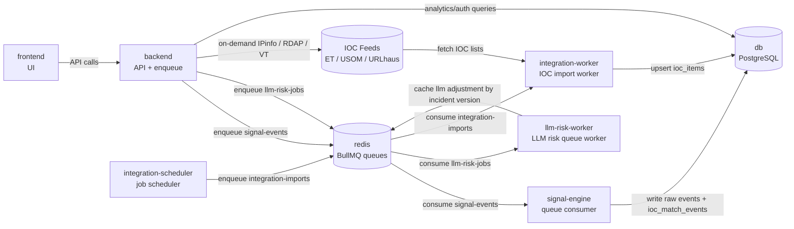

# Container Operations & Tuning Guide

This document tracks container responsibilities, key functions, and tuning/maintenance notes for a TalonHound deployment.

## Environment

- Install path (installer / Compose default): `/opt/TalonHound` or the directory where you cloned the repository
- Startup (source build):

```bash
cd /opt/TalonHound   # or your clone path
docker compose up -d --build
```

---

## Service Inventory

### 1) `db` (PostgreSQL)
**Purpose**
- Primary datastore for users, IOC data, signal events, and detection events.

**Key tables (relevant to current flow)**
- `signal_events` → raw telemetry events (retention: 30 days)
- `ioc_match_events` → IOC matches (kept indefinitely)
- `signal_sources` → connected source metadata (legacy / analytics)
- `ioc_items` → IOC inventory

**Ops notes**
- Check health:
  ```bash
  docker compose exec -T db pg_isready -U talonhound -d talonhound
  ```
- Quick table counts:
  ```bash
  docker compose exec -T db psql -U talonhound -d talonhound -c "SELECT count(*) FROM signal_events;" -c "SELECT count(*) FROM ioc_match_events;"
  ```

---

### 2) `redis`
**Purpose**
- Queue broker for async jobs.
- **AUTH:** `redis-server --requirepass` from required `REDIS_PASSWORD` (compose fails clearly if unset, same pattern as `JWT_SECRET`). All app workers use the same password via `REDIS_HOST` / `REDIS_PORT` / `REDIS_PASSWORD`. No repository-known default password.

**Used queues**
- `integration-imports` (IOC integration jobs)
- `signal-events` (signal processing jobs)
- `llm-risk-jobs` (LLM risk analyze/recompute jobs)

**Ops notes**
- Redis memory should be monitored if event rate increases.
- Smoke AUTH: `docker compose exec -T redis redis-cli -a "$REDIS_PASSWORD" ping` (or paste password from `.env`).

---

### 3) `backend`
**Purpose**
- API layer for auth, UI data, integrations, and analytics.

**Key analytics endpoints**
- `GET /api/analytics/data-sources`
- `GET /api/analytics/raw-events?limit=10`
- `GET /api/analytics/ioc-matches?limit=10`

**Ops notes**
- Runs migrations on startup.
- If startup race appears with other migration-running containers, start backend first.

---

### 4) `signal-engine`
**Purpose**
- Dedicated signal processing worker (BullMQ consumer).
- Reads from `signal-events` queue.
- Writes raw events to `signal_events` and matches to `ioc_match_events`.

**Current behavior**
- Consumes jobs from the `signal-events` queue when producers enqueue them.
- Score/filter logic exists in worker.

**Ops notes**
- Logs:
  ```bash
  docker compose logs -f --tail=100 signal-engine
  ```
- Scale suggestion:
  - Increase `SIGNAL_WORKER_CONCURRENCY`
  - Optionally run multiple replicas (later phase)

---

### 5) `integration-scheduler`
**Purpose**
- Schedules IOC feed import jobs.

### 6) `integration-worker`
**Purpose**
- Executes IOC import jobs and updates IOC dataset.

**Ops notes**
- If IOC updates stop, check both scheduler and worker logs.

---

### 7) `dashboard-map-worker`
**Purpose**
- Batch worker for Threat World Map aggregation.
- Processes IOC rows in chunks (default 1000) and updates precomputed map tables.
- Maintains daily display snapshot (last 24h processed IOC view), refreshed around local midnight.

**Key env vars**
- `DASHBOARD_MAP_CHUNK_SIZE` (default `1000`)
- `DASHBOARD_MAP_INTERVAL_MS` (default `5000`)

**Key tables**
- `dashboard_map_country_totals`
- `dashboard_map_job_state`
- `dashboard_map_pending_events`
- `dashboard_map_display_snapshot`

**Ops notes**
- Logs:
  ```bash
  docker compose logs -f --tail=100 dashboard-map-worker
  ```
- Progress check:
  ```bash
  docker compose exec -T db psql -U talonhound -d talonhound -c "SELECT last_processed_ioc_id, full_rebuild_pending, last_run_at, snapshot_last_refreshed_at FROM dashboard_map_job_state;"
  ```


### 8) IP enrichment (IPinfo Lite, on-demand)
- No dedicated container. Configured in **Administration → Enrichment Providers** (or `IPINFO_LITE_TOKEN` env).
- Results stored in `ioc_ip_enrichment` when analysts enrich an IP from IOC Details.

---


### 10) `llm-risk-worker`
**Purpose**
- Asynchronous LLM risk advisor worker.
- Consumes `llm-risk-jobs` queue and calls Ollama for risk adjustment output.
- Writes versioned results to Redis cache (`risk:llm:incident:<id>:<version>`).

**Behavior**
- Triggered by incident create/significant-change logic and manual analyze action.
- Applies timeout-only retry policy (1 retry, 5s backoff).
- Uses short timeout for background defaults and supports longer manual timeout path.

**Key env vars**
- `LLM_RISK_QUEUE_NAME` (default `llm-risk-jobs`)
- `LLM_RISK_ADVISOR_ENABLED` (default `false`)
- `OLLAMA_BASE_URL` (default `http://127.0.0.1:11434`)
- `OLLAMA_MODEL` (default `qwen2.5:14b`)
- `LLM_RISK_ADVISOR_URL` (Ollama generate endpoint; default `http://127.0.0.1:11434/api/generate`)
- `LLM_RISK_ADVISOR_MODEL` (default `qwen2.5:14b`; falls back to `OLLAMA_MODEL`)
- `LLM_RISK_ADVISOR_TIMEOUT_MS` (default `8000`)
- `LLM_RISK_ADVISOR_MANUAL_TIMEOUT_MS` (default `25000`)
- `LLM_RISK_ADVISOR_AI_WEIGHT` (code default `1`; `docker-compose.yml` may override to `3`)
- `LLM_RISK_ADVISOR_CACHE_TTL_SECONDS` (default `3600`)

**Ops notes**
- Logs:
  ```bash
  docker compose logs -f --tail=100 llm-risk-worker
  ```
- Queue depth check (Redis):
  ```bash
  docker compose exec -T redis redis-cli -a "$REDIS_PASSWORD" LLEN bull:llm-risk-jobs:wait
  ```

### 11) `frontend`
**Purpose**
- Web UI (nginx + static build). **Not published on the host**; reached via `proxy` on the Docker network.

**Current relevant pages**
- Dashboard (world map)
- Analytics
  - Connected Data Sources
  - Last 10 Raw Events
  - Last 10 Detection Events
- Incidents
  - Incident list
  - Incident detail (AI Insight + manual AI analyze action)

### 12) `proxy`
**Purpose**
- TLS termination and HTTP→HTTPS redirect. Publishes host ports **80** and **443**.

**Certs**
- `proxy/certs/cert.pem` and `key.pem` (gitignored `*.pem`). Empty on first run → entrypoint generates a **self-signed** pair for local/demo.

**Ops notes**
```bash
docker compose logs -f --tail=100 proxy
```

---

## System Diagram

Ana diyagramlar ayrı dosyada tutulur:
- `docs/system-diagram.md` (logical flow + deployment view)



---

## Tuning Checklist (Short)

### Performance
- Keep analytics endpoints bounded (`limit`, recent window).
- Prefer precomputed tables (`ioc_match_events`) over heavy runtime joins.
- Add/verify DB indexes after schema updates.

### Reliability
- Avoid migration races by controlling which container runs migrations.
- Keep worker logs visible during demos.
- Use restart policies (already enabled).

### Data lifecycle
- Raw telemetry retained for 30 days.
- IOC match records retained indefinitely.
- Revisit policy if DB growth accelerates.

---

## Daily Ops Commands

```bash
cd /opt/TalonHound   # or your clone path

docker compose ps
docker compose logs --tail=100 backend
docker compose logs --tail=100 integration-worker
```

---

## Change Notes

When adding/removing containers, update this file with:
- container name
- responsibility
- key environment variables
- related endpoint/queue/table
- one health-check command
