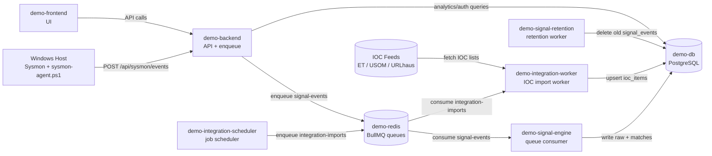
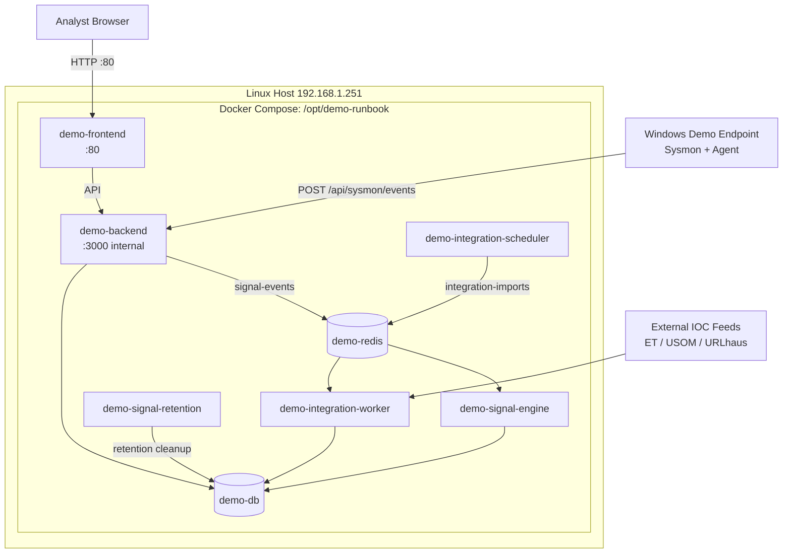

# Demo-Run System Diagram

## 1) Logical Flow

```mermaid
flowchart LR
    W[Windows Host\nSysmon + sysmon-agent.ps1]
    FE[demo-frontend\nUI]
    BE[demo-backend\nAPI + enqueue]
    R[(demo-redis\nBullMQ queues)]
    SE[demo-signal-engine\nqueue consumer]
    SR[demo-signal-retention\nretention worker]
    IS[demo-integration-scheduler\njob scheduler]
    IW[demo-integration-worker\nIOC import worker]
    DB[(demo-db\nPostgreSQL)]
    EXT[(IOC Feeds\nET / USOM / URLhaus)]

    W -->|POST /api/sysmon/events| BE
    FE -->|API calls| BE

    BE -->|enqueue signal-events| R
    R -->|consume signal-events| SE
    SE -->|write raw + matches| DB

    IS -->|enqueue integration-imports| R
    R -->|consume integration-imports| IW
    EXT -->|fetch IOC lists| IW
    IW -->|upsert ioc_items| DB

    SR -->|delete old signal_events| DB
    BE -->|analytics/auth queries| DB
```

## 2) Deployment View (Host + Container Boundary)

```mermaid
flowchart TB
    WIN[Windows Demo Endpoint\nSysmon + Agent]
    IOC[External IOC Feeds\nET / USOM / URLhaus]

    subgraph HOST[Linux Host 192.168.1.251]
      subgraph COMPOSE[Docker Compose: /opt/demo-runbook]
        FE[demo-frontend\n:80]
        BE[demo-backend\n:3000 internal]
        R[(demo-redis)]
        DB[(demo-db)]
        SE[demo-signal-engine]
        SR[demo-signal-retention]
        IS[demo-integration-scheduler]
        IW[demo-integration-worker]
      end
    end

    USER[Analyst Browser] -->|HTTP :80| FE
    FE -->|API| BE
    WIN -->|POST /api/sysmon/events| BE

    BE -->|signal-events| R
    R --> SE
    SE --> DB

    IS -->|integration-imports| R
    R --> IW
    IOC --> IW
    IW --> DB

    SR -->|retention cleanup| DB
    BE --> DB
```
