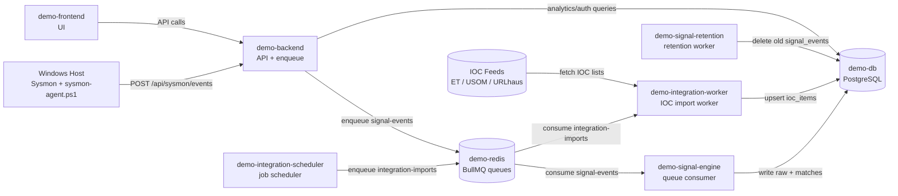

# Demo-Run System Diagram

```mermaid
flowchart LR
    W[Windows Host\nSysmon + sysmon-agent.ps1]
    FE[demo-frontend\nUI]
    BE[demo-backend\nAPI + enqueue]
    R[(demo-redis\nBullMQ queues)]
    SE[demo-signal-engine\nqueue consumer]
    SR[demo-signal-retention\nretention worker]
    IS[demo-integration-scheduler\njob scheduler]
    IW[demo-integration-worker\nIOC import worker]
    DB[(demo-db\nPostgreSQL)]
    EXT[(IOC Feeds\nET / USOM / URLhaus)]

    W -->|POST /api/sysmon/events| BE
    FE -->|API calls| BE

    BE -->|enqueue signal-events| R
    R -->|consume signal-events| SE
    SE -->|write raw + matches| DB

    IS -->|enqueue integration-imports| R
    R -->|consume integration-imports| IW
    EXT -->|fetch IOC lists| IW
    IW -->|upsert ioc_items| DB

    SR -->|delete old signal_events| DB
    BE -->|analytics/auth queries| DB
```
