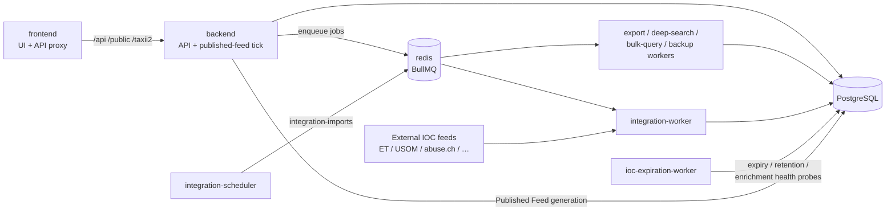
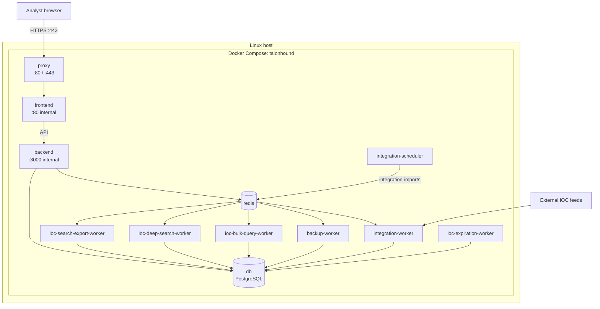

# TalonHound System Diagram

Runtime architecture for the current Compose deployment. Service list: [`docker-compose.yml`](../docker-compose.yml). Operations detail: [container-operations-and-tuning.md](./container-operations-and-tuning.md).

## 1) Logical flow

## 2) Deployment view (host + container boundary)

Host-published ports: **80** and **443** on `proxy` only.
